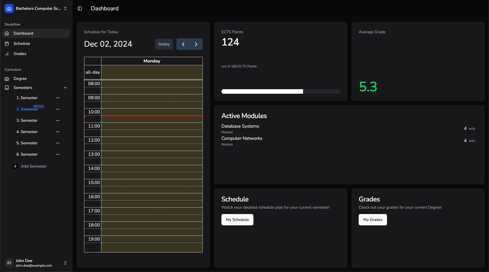

# StudyFlow - Academic Management Web Application 📚 🎓
[](https://opensource.org/licenses/MIT)

StudyFlow is a web application designed to help students manage their academic schedules, track their grades, and organize their study materials. It provides tools for creating and viewing schedules, tracking grades, and organizing study materials in one place. With a user-friendly interface and cross-platform accessibility, StudyFlow aims to simplify academic management for students.



# Group 3 - Team Members 🧑‍🧑‍🧒‍🧒
All Members listed worked on either frontend or backend to develop the StudyFlow application.

### - Shpetim Veseli
### - Michael Vömel
### - Leona Kryeziu
### - Tobias Kugel
### - Jil Zerndt

## Table of Contents
- [Installation](#backend)
- [Backend Server using Gradle](#backend)
    - [Backend](#backend)
    - [Frontend](#frontend)
- [Class Diagrams](#class-diagrams)
- [License](#license)

# ⚡️Key Features
- **User Authentication**: Users can create an account, log in, and log out.
- **Dashboard**: Users can view their upcoming events, grades, and study materials.
- **Schedule**: Users can create, view, and edit their schedules.
- **Grades**: Users can track their grades and view their grade statistics.
- **Degrees**: Users can add and view their degrees.
- **Semesters**: Users can add and view their semesters.


## 🚀 Getting Started

To get started ensure you have the prerequisites installed and follow the steps below.
## Prerequisites
- [Node](https://nodejs.org/en) must be installed.


### Backend

To build the Gradle web server located in the backend directory, follow these steps:

1. Navigate to the Backend Directory:
    ```sh
    cd ./studyflow/backend
    ```
   
2. Clean the project:
    ```sh
    ./gradlew clean
    ```
   
3. Build the project:
    ```sh
    ./gradlew build
    ```
   
4. Run the Gradle server:
    ```sh
    ./gradlew run
    ```
   
The backend server will no be accessible at `http://localhost:8080`.
It is necessary to have the backend server running before starting the frontend.


### Frontend

1. Navigate to the frontend directory:
    ```sh
    cd ../studyflow/client
    ```

2. Install the necessary dependencies:
    ```sh
    npm install
    ```
   
3. Start the frontend:
    ```sh
    npm run dev
    ```
4. The frontend is now accessible at [http://localhost:3000](http://localhost:3000). You will be on the landing page. To sign up click on the 'Start now' button at the top right.

## Class Diagrams

For detailed class diagrams, please refer to the [backend architecture documentation](https://github.com/mvoemel/studyflow/blob/dev/docs/backendArchitecture.md).

## Testing Concept

For detailed information on the testing strategy and test cases, please refer to the [testing concept documentation](https://github.com/mvoemel/studyflow/blob/dev/docs/testingConcept/Test_Cases.md).


## License

This project is licensed under the MIT License. See the `LICENSE` file for more details.